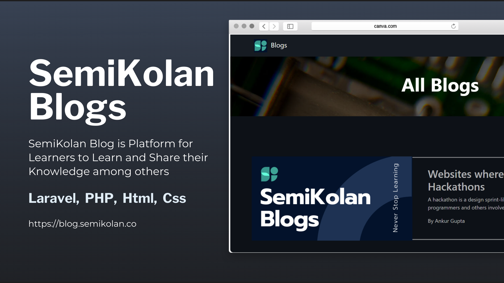

  

# Semikolan Blogs
This Repository contains the source code of Semikolan Blogs at  [blog.semikolan.co](blog.semikolan.co)
Some links for Semikolan blog:
Website: [Semikolan Blog](https://blog.semikolan.co)
Login Page: [Login](https://blog.semikolan.co/login)
Register Page: [Register](https://blog.semikolan.co/register)

You can also join the [Semikolan Discord Server](https://discord.semikolan.co) to have a discussion about the project or ask out about any other queries.

# Getting started

## Installation

Please check the official laravel installation guide for server requirements before you start. [Official Documentation](https://laravel.com/docs/5.4/installation#installation)

 
Fork this repository and clone it to your local machine.

    git clone https://github.com/<your_username>/blog.semikolan.co.git

Switch to the repo folder

    cd blog.semikolan.co

Install all the dependencies using composer

    composer install

Copy the example env file and make the required configuration changes in the .env file

    cp .env.example .env

Generate a new application key

    php artisan key:generate

Run the database migrations (**Set the database connection in .env before migrating**)

    php artisan migrate

Start the local development server

    php -S localhost:8000

You can now access the server at http://localhost:8000

## Database seeding

**Populate the database with seed data with relationships which includes users, blogs, categories, subcategories, reports and subscribers. This can help you to quickly start testing  and start using it with ready content.**

Open the DatabaseSeeder and set the property values as per your requirement

    database/seeds/DatabaseSeeder.php

Run the database seeder and you're done

    php artisan db:seed

***Note*** : It's recommended to have a clean database before seeding. You can refresh your migrations at any point to clean the database by running the following command

    php artisan migrate:refresh
    

## Codebase Structure

- `app/Http/Models` - Contains all the Eloquent models
- `app/Http/Controllers` - Contains all Controllers
- `app/Http/Middleware` - Contains the  middleware
- `config` - Contains all the application configuration files
- `database/migrations` - Contains all the database migrations
- `database/seeds` - Contains the database seeder
- `routes` - Contains all the routes defined in web.php file
- `tests` - Contains all the application tests (Currently not in use)
- `vendor` - Contains all the third party libraries
- `public` - Contains all the public assets
- `resources/views` - Contains all the views
- `resources/views/layouts` - Contains the layouts

## Environment variables

- `.env` - Environment variables can be set in this file

***Note*** : You can quickly set the database information and other variables in this file and have the application fully working.

----------
